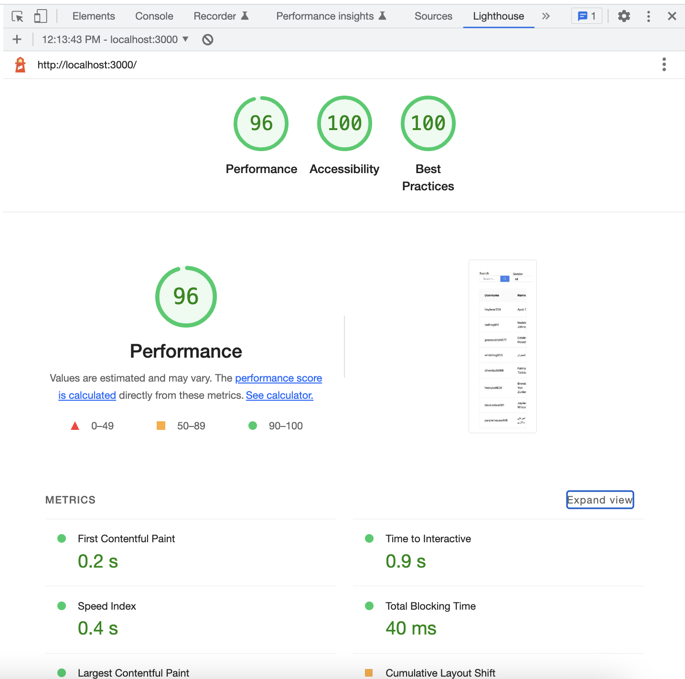

## Miraculous Project

A web application (sample project) to show user data from Random User Generator API (https://randomuser.me/api) with functionalities to search by keyword name with debounce search, filter by gender, sort by table column, and pagination.

#

## 1. Tech Stack and Methodologies

This project was developed using React, Webpack, Babel, Redux Toolkit, Tailwind CSS, React Testing Library, Storybook, Atomic Design, and Component-Driven Development (CDD). The project was setup from scratch using webpack and babel manually. `webpack.config.js` and `.babelrc` can be found on root folder. And all components of this project was created from scratch using Tailwind CSS.

#### a. Packages

List of packages on this project:

- @babel/cli: Allow to use Babel to compile files directly from the command line.
- @babel/core: The core or main package that is needed to use Babel in the project.
- @babel/preset-env: Used to convert ES6 JavaScript syntax into backward versions of JavaScript supported by older browsers.
- @babel/preset-react: Used to convert React syntax (jsx) into backward versions of JavaScript supported by older browsers.
- webpack: The actual package that enable to use webpack in the project.
- webpack-cli: Allow to run webpack commands in the command line.
- webpack-dev-server: Webpack server will act as server in development.
- html-webpack-plugin: HtmlWebpackPlugin simplifies creation of HTML files to serve webpack bundles.
- react: The actual react package that enables to use react in the project.
- react-dom: Serves as the entry point to the DOM and server renderers for React. It is intended to be paired with the react package.
- eslint: A lint for identifying and reporting on patterns found in ECMAScript/JavaScript code.
- prettier: Code formatter that styles code consistently. It is supports HTML, CSS, Javascript, and most of their libraries.
- eslint-config-prettier: Turns off all eslint rules that are unnecessary or might conflict with Prettier and to make sure that eslint only check code syntax style while Prettier check code formatting.
- eslint-import-resolver-webpack: Resolve paths to dependencies, given a webpack.config.js.
- @testing-library/react: The core dependency that install react testing library for testing purpose.
- @testing-library/jest-dom: A virtual DOM for jest allow to use custom jest matchers to extend jest with react testing library.
- jest: the core dependency required for Jest to work.
- jest-environment-jsdom: To allow to use jsdom and will use it together with @testing-library/jest-dom.
- eslint-plugin-jest: To make sslint recognise jest code.
- tailwindcss: A core package that installs Tailwind CSS.
- autoprefixer: A PostCSS plugin that Tailwind CSS uses to automatically adds vendor prefixes to write styles supported by all browsers.
- postcss: A tool for transforming styles with JS plugins. These plugins can lint your CSS, support variables and mixins, transpile future CSS syntax, inline images, and more.
- style-loader: used by webpack to inject CSS into the DOM.
- css-loader: used by webpack to interprets and resolve imports in CSS.
- postcss-loader: used by webpack to process PostCSS.

#### b. Configuration

- ESLint: The ESLint was configured using Airbnb JavaScript styles by `npm init @eslint/config`.

- Husky and pre-commit: Allows to work with Git hooks. Git hooks are scripts that can set up to run at certain events in the Git lifecycle like before every commit or push. On this project, pre-commit and Husky was configured using `lint-staged`.

- Storybook: a development tool to run and test UI components without a complete React environment for component-driven development.

#### c. Methodology

1. Atomic Design

   Atomic design is a methodology composed of five distinct stages working together to create interface design systems in a more deliberate and hierarchical manner. The five stages of atomic design are:

   - Atoms
   - Molecules
   - Organisms
   - Templates
   - Pages

   On this project, UI components was created with Atomic Design methodology and can found on `src/components` folder. The Pages was separated from components folder to make easier to manage projects by module (example: module home).

2. Component-Driven Development (CDD)

   Component-Driven Development (CDD) is a development methodology that anchors the build process around components. It is a process that builds UIs from the “bottom up” by starting at the level of components and ending at the level of pages or screens. This methodology is closely related to Atomic Design. Before develop React page, we can create the components first. To visualize the components, we use Storybook. And this is the example of the components:

   - Component Organisms - SearchFilterUserlist
     

   - Component Templates - UserList
     

#

## 2. UI and Functionalities

#### a. UI - Home

The main UI (Home) will contain table userlist, search bar for name, dropdown gender, button to reset filter, sort icon, and pagination.

#### b. Functionalities

- Get data from API https://randomuser.me/api using axios and redux toolkit (as state management) and show on table.
- Pagination for data paging. On this project, total data was hard coded beacuse from the API not return the total data. Based on the API documentation, the API can return up to 5000 rows data. But on this project, we are use total count is 100 rows data and total data per page is 10 rows data.
- Search by keyword name. On `Enter` or click icon Search, it will send request to the API based on keyword value and the result will updated on table. The search already implemented using debounce search to ensure that expensive operations like API calls are not executed too frequently.
- Filter by gender. On change the dropdown, it will send request to the API based on selected value and the result will updated on table.
- Sort by table column name, email, gender, and registered date. On this project, the table data can be sorted by ascending or descending only on single column (can not combined sort). To sort it, we can click on table head column or on table body column. By default, the data is not sorted and the color of icon is gray. On sort by ascending, icon arrow-up will active. And on sort by descending, arrow-down will active.
- Reset filter: By click button reset filter, it will reset all active filters and back to first page.

#

## 3. Running Project and Available Scripts

### a. Running Project

To running this project, you need to clone from this code repository or running this command from your terminal: `git clone https://github.com/rasp20/miraculous.git`. From the terminal, run `npm install` to install all packages and then run `npm run start` to run the project on your local for development mode. And open http://localhost:3000 to view it in your browser. For more scripts, you can find it on Available Scripts.

### b. Available Scripts

Available scripts on this projects:

- `npm run start` : Run the project on local for development mode.
- `npm run build` : Builds the app for production to the `dist` folder.
- `npm run lint` : To check the errors and fix the issues for all files.
- `npm run format`: To format all files based on prettier rules.
- `npm run test`: To run test.
- `npm run coverage`: To run test and get test coverage info.
- `npm run storybook`: To start storybook and view it in your browser at http://localhost:6006.

#

## 4. Unit Test and Code Coverage

On this project, we are using React Testing Library to test components. But still not all components have test file. Unit test for atoms components can be found on `src/__test__`.

- Current code coverage result:
  

#

## 5. Performance, Accessibility, and Best Practices Test

Performance, Accessibility, and Best Practices Test with Lighthouse.

- Lighthouse test result:
  

#

## 6. Tech Debt

This tech debt list is list of things that can be improve or implement in the next development:

- Improve code coverage by create test file for all components and redux actions.
- Implement Lazy Load for table if needed.

#

## 6. Deployment

This project was deployed using vercel. To preview the project, you can access https://miraculous-project.vercel.app/
